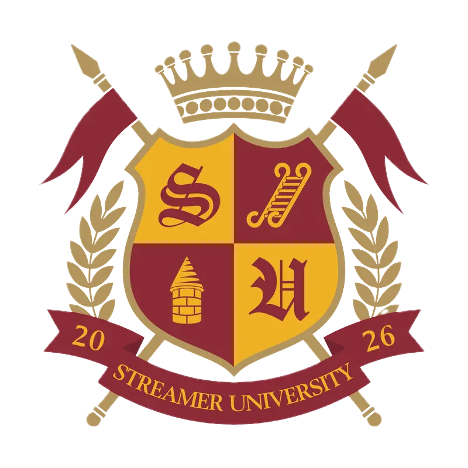

<div align="center">
  

  # Streamer University Watch

  A campus-wide live directory, multiview experience, and event archive for Streamer University 2026.

  [Live site](https://streameruniversity.watch) · [Campus](https://streameruniversity.watch/campus) · [2026 Wrapped](https://streameruniversity.watch/wrapped)
</div>

> [!IMPORTANT]
> This is an independent, unofficial fan project. It is not affiliated with or
> endorsed by Streamer University, Twitch, Kick, YouTube, Streams Charts, or
> any featured creator.

## Why I Built It

Streamer University brought hundreds of creators together, but following the
event meant already knowing each creator's username, finding the correct
channel, and switching constantly between tabs. I built Streamer University
Watch to make the campus feel like one coherent live event: a viewer could find
any participant, discover someone new, watch several perspectives at once, and
catch up after the event ended.

The product found a real audience during the event:

- More than **600,000 page views**
- Nearly **90,000 visitors**
- More than **200,000 views across social media**

## What It Does

- **Campus directory:** Search and filter faculty, students, and returning
  alumni. Live channels sort to the top automatically.
- **Live discovery:** Popular and Rising shelves balance the largest broadcasts
  with smaller creators, while Random opens a live campus channel immediately.
- **Channel pages:** Watch supported livestreams and Twitch chat from a focused,
  responsive channel route.
- **Lecture Hall:** Select up to eight live Twitch channels, search within the
  live roster, switch chats, and choose layouts that adapt to the number of
  selected streams.
- **Trending in the Dorms:** Surface the most-viewed campus Twitch clips from a
  rolling 24-hour window.
- **Cross-platform status:** Normalize live metadata from Twitch, Kick, and
  YouTube into one directory model.
- **Streamer University Wrapped:** Preserve the event with viewing totals,
  growth leaderboards, top clips, the full class roll, and closing-ceremony
  awards.
- **Responsive experience:** Desktop prioritizes directory, video, and chat;
  mobile uses horizontal discovery shelves and a compact stream-first layout.

## How It Works

The application is built with:

- **Next.js 16** and the App Router
- **React 19** and **TypeScript**
- **Tailwind CSS** plus a dedicated CSS module for Wrapped
- **Twitch Helix API** for users, streams, games, and clips
- **Kick Public API** and **YouTube Data API v3** for optional live status
- **Streams Charts data** for the historical Wrapped snapshot
- **Vercel** for hosting, CDN caching, and optional Web Analytics

The server routes batch roster lookups and return a shared normalized payload.
Fast-changing live status uses short CDN cache windows, stable profile metadata
uses longer revalidation, and clip rankings use a four-hour cache with stale
responses available during refreshes. This keeps the interface current without
turning every visitor into a new upstream API request.

```text
Platform APIs
    ↓
Next.js API routes (batching, normalization, caching)
    ↓
Campus directory / channel pages / Lecture Hall
    ↓
Static Wrapped snapshot after the event
```

## Building With GPT-5.6 and Codex

I collaborated with OpenAI Codex throughout the project as a persistent
engineering partner, not as a one-shot code generator. GPT-5.6 and Codex were
especially valuable because the product evolved through many small,
interdependent decisions while the live event was already attracting traffic.

### Where Codex Accelerated the Work

- Translated annotated screenshots and interaction descriptions into working
  React and Tailwind implementations.
- Traced the existing code before each change and made focused patches without
  discarding working behavior.
- Implemented and refined the responsive directory, channel pages, discovery
  shelves, search states, and the one-to-eight-stream Lecture Hall layout
  matrix.
- Helped normalize Twitch, Kick, and YouTube responses behind a common channel
  model.
- Diagnosed production-only failures involving cache keys, partial Twitch clip
  responses, API rate limits, and platform-specific live metadata.
- Used visual browser checks, linting, TypeScript, and production builds to
  verify desktop and mobile changes after implementation.
- Helped turn the completed event into Wrapped by shaping provider data into
  totals, leaderboards, clips, creator profiles, and awards.

### Decisions I Made

I owned the product direction and final tradeoffs: organizing the roster around
faculty, students, and alumni; using a familiar livestream interface; creating
Popular and Rising as separate discovery goals; making Random a first-class
action; defining every Lecture Hall layout; deciding what mobile should omit;
and establishing burgundy, gold, grayscale, and live red as distinct semantic
colors.

I also chose the freshness-versus-cost balance for each API, the eight-stream
multiview limit, the 24-hour clip window, the post-event landing experience,
and which statistics and awards belonged in Wrapped. Codex accelerated the
engineering and iteration, while I remained responsible for the audience,
feature set, design judgment, and release decisions.

### What GPT-5.6 Contributed

GPT-5.6's long-context reasoning helped Codex maintain continuity across the
roster, platform rules, responsive behavior, visual language, and caching
constraints. That made it possible to debug the whole system rather than treat
each screenshot or bug as an isolated request. The final result reflects that
collaboration: rapid AI-assisted implementation under continuous human product
direction.

## Challenges and Lessons

### Real-time data without runaway API usage

Live status and viewer counts need frequent updates, while user profiles and
clips do not. Early versions requested too much clip data and encountered
Twitch rate limits. Batching, bounded concurrency, stable time buckets, shared
CDN caching, and degraded responses made the system both fresher and safer.

### One roster across multiple platforms

The supported APIs disagree on naming, authentication, metadata, and live-state
shape. A common internal `Channel` model keeps those differences out of most of
the interface.

### Designing multiview for one through eight streams

Lecture Hall is not one responsive grid. Each channel count has layouts with
different priorities for the focused stream, secondary streams, and chat. The
layout previews and rendered CSS grids are driven by the same selection state
so the controls accurately represent the result.

### Mobile embeds and browser privacy

Third-party stream and chat embeds behave differently across browsers,
especially where cross-site cookies are restricted. The mobile experience
therefore focuses on a clear stream-and-chat hierarchy while leaving platform
authentication to the official embeds.

The largest lesson was that a live-event product has to fail gracefully. A
slightly stale but complete campus is more useful than a fresh, partial ranking.

## Run Locally

### Requirements

- Node.js 20.9 or newer
- A Twitch developer application
- Optional Kick and YouTube developer credentials

### Setup

```bash
git clone https://github.com/daiviksiddhi/streamer-uni.git
cd streamer-uni
npm install
cp .env.example .env.local
npm run dev
```

Open the local URL printed by Next.js. If port 3000 is occupied, Next.js will
select another available port.

Configure only the services you want to use:

```dotenv
TWITCH_CLIENT_ID=your_twitch_client_id
TWITCH_CLIENT_SECRET=your_twitch_client_secret
KICK_CLIENT_ID=your_kick_client_id
KICK_CLIENT_SECRET=your_kick_client_secret
YOUTUBE_API_KEY=your_youtube_api_key
```

Never expose client secrets through `NEXT_PUBLIC_*` variables or commit an
`.env.local` file. The included `.gitignore` excludes local environment files.

### Commands

```bash
npm run dev               # Start the development server
npm run lint              # Run ESLint
npm run build             # Create a production build
npm run start             # Serve the production build
npm run wrapped:generate  # Rebuild the static Wrapped dataset
```

`wrapped:generate` expects a provider snapshot at `STREAMS_CHARTS_SOURCE` and
optionally uses Twitch credentials for event clips and creator portraits. The
checked-in Wrapped JSON is a static historical artifact, so normal development
does not require that provider snapshot.

## Routes

| Route | Purpose |
| --- | --- |
| `/` | Post-event landing page |
| `/campus` | Full campus directory and discovery experience |
| `/[login]` | Individual creator viewing page |
| `/multiview` | Lecture Hall multiview |
| `/wrapped` | Streamer University Wrapped 2026 |

## Privacy and Analytics

The deployed project uses Vercel Web Analytics for anonymous, aggregate traffic
measurement. Remove `<Analytics />` from `app/layout.tsx` and the
`@vercel/analytics` dependency if you do not want analytics in your deployment.
Stream and chat embeds are provided by their respective platforms and remain
subject to those platforms' privacy policies and authentication behavior.

## License and Trademarks

Original source code and documentation are available under the [MIT License](LICENSE).
Third-party marks, platform content, creator media, and visual assets are not
granted under that license. See [Third-Party Notices](NOTICE.md) before
redistributing or deploying a derivative.

Built by [Daivik Siddhi](https://x.com/daiviksiddhi) for OpenAI Build Week 2026.
